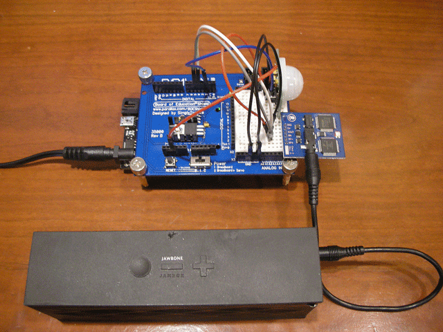

kidalert
=========

Arduino project using passive infra-red sensor and text-to-speech chip to say "go back to bed" when my daughter leaves her room at night.

Hardware Requirements
---------------------
* An Arduino  (I used an [OSEPP Uno R3 Plus](http://osepp.com/products/arduino-compatible-boards/uno-r3-plus/))
* An [Emic 2 TTS Module](http://www.adafruit.com/products/924)
* A [Parallax PIR motion sensor](http://www.parallax.com/Store/Sensors/ObjectDetection/tabid/176/CategoryID/51/List/0/SortField/0/Level/a/ProductID/83/Default.aspx})
* A powered speaker with a 1/8" plug (I used a Jawbone Jambox)
* A solderless breadboard (I used a [Parallax BOE arduino Shield](http://www.parallax.com/Store/Education/KitsandBoards/tabid/182/CategoryID/67/List/0/SortField/0/Level/a/ProductID/819/Default.aspx))

Software Requirements
---------------------
* Arduino IDE 1.0 or 1.0.1

Acknowledgements
----------------
* I lifted [Dan Malecs's](http://danmalec.blogspot.com/) excellent Emic2TtsModule code from the [SocialChatter](https://github.com/dmalec/SocialChatter) project.
